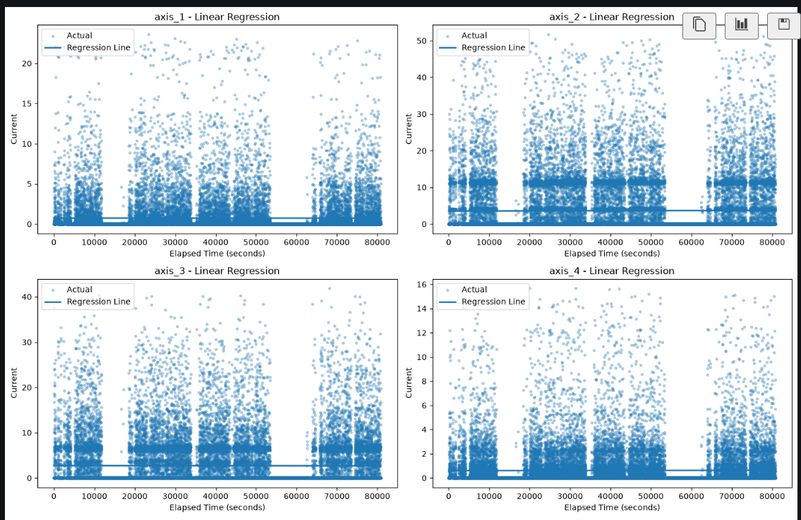
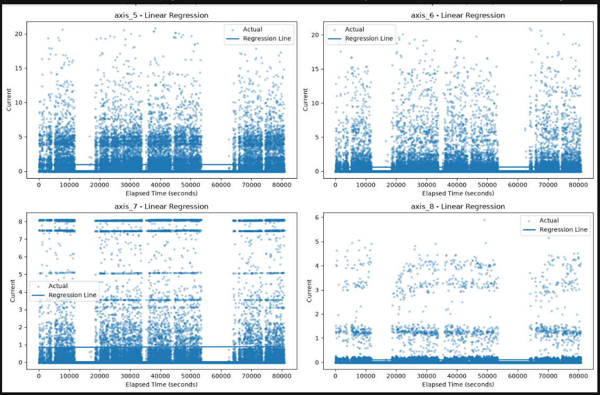
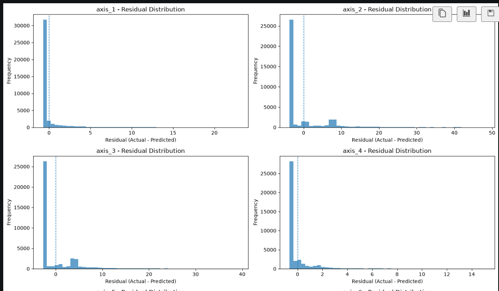
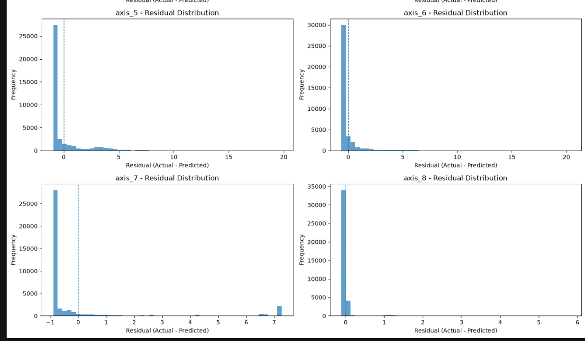
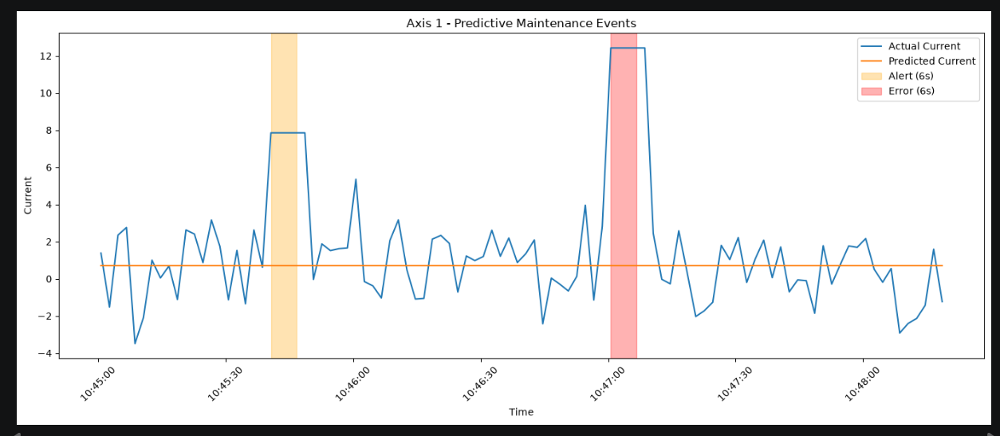

# Predictive Maintenance Using Linear Regression

## Project Summary

This project demonstrates a predictive maintenance system using industrial electrical current data.

Historical sensor data is stored in a Neon PostgreSQL database and used to train separate Linear Regression models for Axis #1 through Axis #8. The models estimate the expected current values over time.

Residuals, which are the differences between the actual and predicted current values, are analyzed to determine Alert and Error thresholds. Synthetic sensor data is then generated and streamed into the database to simulate incoming machine readings.

The system detects sustained unusual current behavior, records Alert and Error events, and visualizes the detected events.

## Project Structure

```text
Predictive-Maintenance-Linear-Regression/
│
├── data/
│   └── RMBR4-2_export_test.csv
│
├── logs/
│   └── predictive_events.csv
├── screenshots/
│   ├── Regression_model_1_2_3_4.png
│   ├── Regression_model_5_6_7_8.png
│   ├── Residuals_1_2_3_4.png
│   ├── Residuals_5_6_7_8.png
│   └── Axis_1_Predictive_Maintenance_Events.png
│
├── src/
│   ├── data_service/
│   │   ├── __init__.py
│   │   └── database_manager.py
│   ├── load_training_data.py
│   └── predictive_maintenance.ipynb
│
├── .gitignore
├── README.md
└── requirements.txt
```

- **data/** contains the historical sensor dataset used for training.
- **logs/** contains the Alert and Error events detected by the system.
- **database_manager.py** manages the PostgreSQL database connection, tables, inserts, and queries.
- **screenshots/** contains the regression, residual, and predictive maintenance event visualizations used in this README.
- **load_training_data.py** cleans the historical CSV data and stores it in PostgreSQL.
- **predictive_maintenance.ipynb** contains the regression analysis, residual analysis, threshold discovery, synthetic streaming simulation, event detection, and visualization.
- **requirements.txt** lists the Python packages required to run the project.

## Installation and Setup

### 1. Clone the Repository

```bash
git clone https://github.com/PreethiVNair/Predictive-Maintenance-Linear-Regression.git
cd Predictive-Maintenance-Linear-Regression
```

### 2. Create a Virtual Environment

```bash
python -m venv .venv
```

Activate the virtual environment on Windows:

```bash
.venv\Scripts\activate
```

### 3. Install the Required Packages

```bash
pip install -r requirements.txt
```

### 4. Configure the Database Connection

Create a `.env` file in the project root and add the Neon PostgreSQL connection string:

```text
DATABASE_URL=your_neon_database_connection_string
```

The `.env` file is excluded from Git using `.gitignore` so that database credentials are not uploaded to GitHub.

### 5. Load the Historical Training Data

From the project root, run:

```bash
python src/load_training_data.py
```

This cleans the historical CSV data and stores the required sensor readings in the PostgreSQL `training_data` table.

### 6. Run the Predictive Maintenance Notebook

Open:

```text
src/predictive_maintenance.ipynb
```

Run the notebook from top to bottom to perform the regression analysis, threshold discovery, synthetic streaming simulation, Alert/Error detection, event logging, and visualization.

## Linear Regression and Residual Analysis

A separate Linear Regression model is trained for each sensor axis from Axis #1 through Axis #8.

The timestamp is converted into elapsed seconds so that time can be used as a numerical input for Linear Regression.

For each axis, the model predicts the expected current value based on time. The residual is then calculated as:

**Residual = Actual Current - Predicted Current**

A positive residual means the measured current is above the value predicted by the regression model.

Residual distributions are analyzed separately for each axis because the axes have different current ranges and behavior.

## Threshold Discovery

Alert and Error thresholds are determined from the residual distribution of each individual axis.

- **MinC** is the 95th percentile of the training residuals for an axis.
- **MaxC** is the 99th percentile of the training residuals for an axis.
- **T** is the minimum amount of time that the abnormal residual must continue before an event is recorded.

The historical data has a median sampling interval of approximately 1.89 seconds. A duration threshold of **T = 6 seconds** is used so that a single unusual reading does not immediately create an Alert or Error.

An **Alert** is recorded when the residual remains between MinC and MaxC for at least 6 continuous seconds.

An **Error** is recorded when the residual remains at or above MaxC for at least 6 continuous seconds.

The thresholds are calculated separately for every axis because each axis has a different residual distribution and current range.

## Synthetic Data and Streaming Simulation

Synthetic sensor readings are generated to test the predictive maintenance system without modifying the historical training data.

For each axis, the mean and standard deviation from the historical training data are used to generate synthetic readings with similar statistical characteristics.

A StandardScaler is fitted using the historical training data and applied to the synthetic test data. The regression models, residuals, and thresholds remain in the original current units so that MinC and MaxC can be compared directly with the residual values.

Known sustained anomalies are added to Axis #1 to verify that the Alert and Error detection logic works correctly.

The synthetic readings are inserted into the PostgreSQL `stream_data` table one reading at a time to simulate incoming sensor data. The simulation uses a short playback delay while the timestamps preserve the sensor timing.

## Alert and Error Detection

The system checks the residual of each incoming sensor reading against the thresholds calculated for that axis.

- **Normal:** The residual is below MinC.
- **Alert:** The residual remains between MinC and MaxC for at least T seconds.
- **Error:** The residual remains at or above MaxC for at least T seconds.

The duration requirement helps prevent isolated spikes from immediately being classified as maintenance events.

Detected events include the axis, event type, start time, detection time, and duration. These events are saved to:

```text
logs/predictive_events.csv
```

## Results and Visualization

The final test run successfully retrieved **39,672 historical training records** from PostgreSQL and processed **100 synthetic streaming readings**.

The test data included known sustained anomalies on Axis #1. The detection system successfully identified:

- an **Alert** on Axis #1 lasting 6 seconds
- an **Error** on Axis #1 lasting 6 seconds

Additional Alert events may also be detected when randomly generated synthetic readings naturally satisfy the threshold and duration conditions.

The final visualization for Axis #1 displays the actual current, predicted current, and the time periods where Alert and Error conditions were detected.

Detected events are also stored in `logs/predictive_events.csv`.

### Regression Models

The following plots show the historical sensor readings and the fitted Linear Regression line for Axis #1 through Axis #8.





### Residual Distributions

The residual plots show the distribution of the differences between the actual and predicted current values for each axis.





### Predictive Maintenance Events

The final Axis #1 visualization shows the actual and predicted current together with the detected Alert and Error periods.

